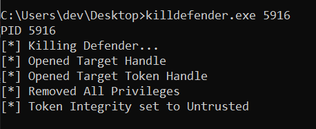
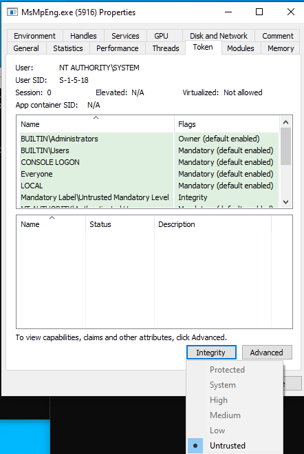

# KillDefender
A small POC to make defender useless by removing its token privileges and lowering the token integrity  

# Usage

killdefender.exe pid

# Preview 

# Credits to Gabriel Landau
 https://elastic.github.io/security-research/whitepapers/2022/02/02.sandboxing-antimalware-products-for-fun-and-profit/article/
